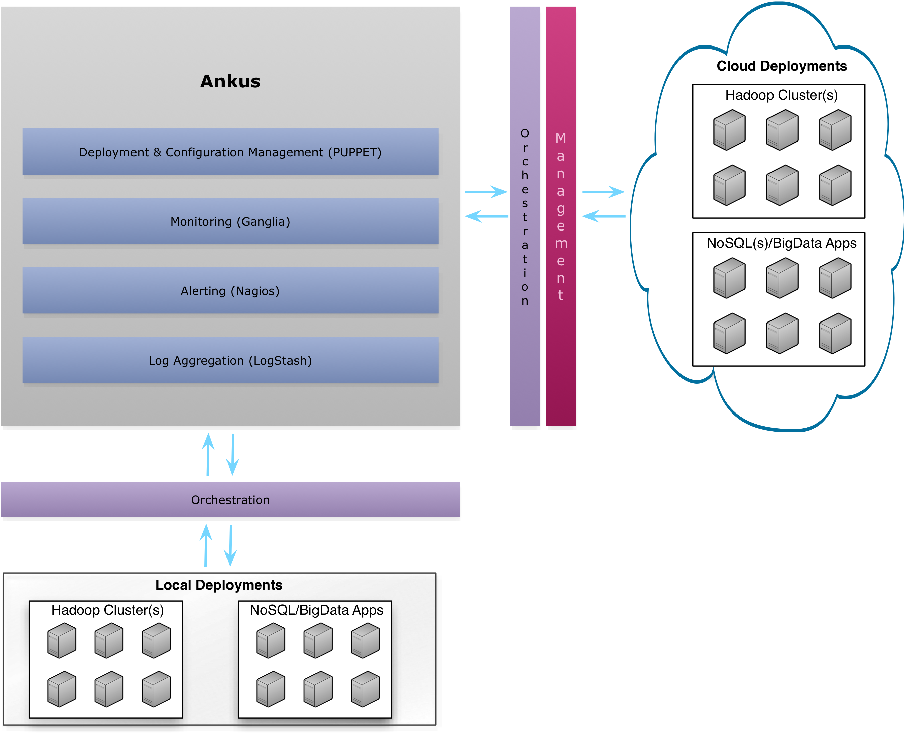
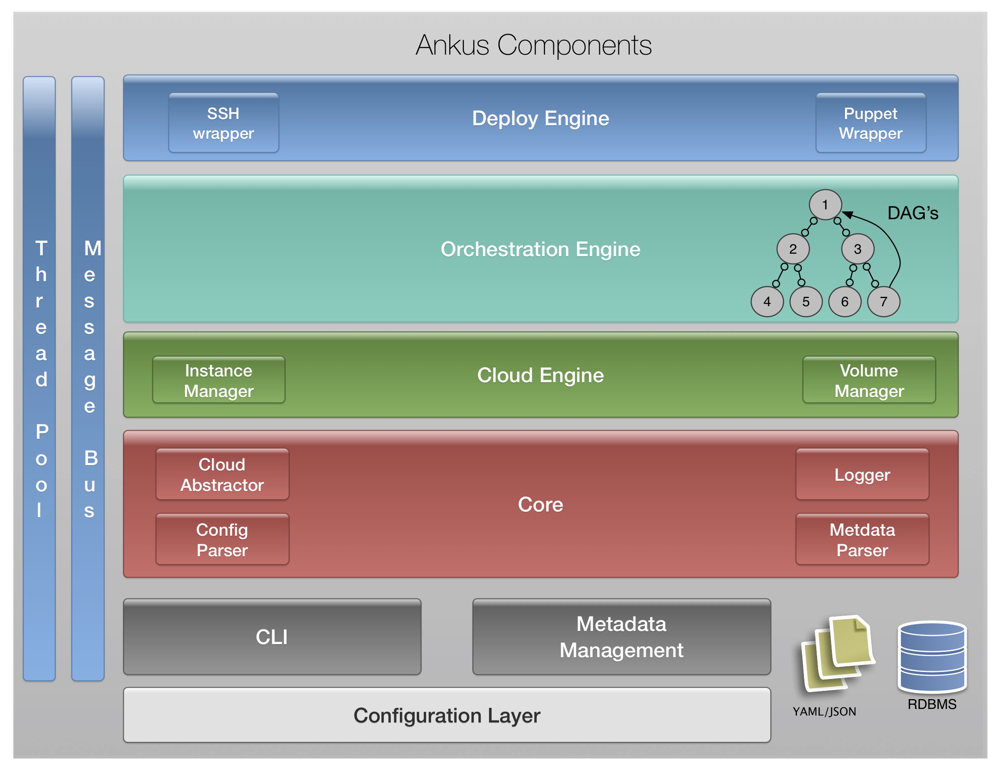

Ankus
=====
Ankus is a big-data deployment & orchestration tool. Handles the installation & management of:

 - [hadoop](http://hadoop.apache.org/) (latest)
 - hadoop ecosystem tools: [pig](http://pig.apache.org/) (latest), [hive](http://hive.apache.org/) (latest), [sqoop2](http://sqoop.apache.org/), [oozie](http://oozie.apache.org/) (latest), hadoop-search
 - [hbase](http://hbase.apache.org/) (latest)
 - [cassandra](http://cassandra.apache.org/) (latest)
 - [kafka](http://kafka.apache.org/) (kafka-0.8)
 - [storm](http://storm-project.net/) (storm-0.8.2)

 Ankus can handle deployments in *local* (group of local machines) as well as *cloud* (servers hosted by cloud providers).

 1. **Local mode** -  User can specify instance roles, supported operating systems (`centos` or `ubuntu`) for deployments.
 2. **Cloud mode** -  Ankus will create/manage instances and auto assigns roles to them. Currently ankus supports [AWS(Amazon Web Services)](http://aws.amazon.com/), [RackSpace](http://www.rackspace.com/) & [OpenStack](https://www.openstack.org/).

**Ankus leverages several open source tools such as:**

 - puppet & puppetdb for deployment and configuration management
 - passenger for scaling the deployments
 - ganglia for monitoring
 - nagios for alerting
 - logstash for log aggregation

**Supported Deployment Types:**

 - Highly Available Hadoop & HBase cluster deployments
 - Secure Hadoop & HBase cluster deployments (using kerberos)
 - Cassandra, Storm & Kafka deployments

###Ankus Architecture

---



---

###Ankus Internal Components

---



---

Installation
------------

> *Scripted way to install ankus (this is still **experemental**, use at your own risk or use the manual process specified below)*
> `bash <(curl -sO https://raw.githubusercontent.com/ashrithr/ankus/master/install_ankus.sh)`

###Dependencies

To install ruby 1.9.3 and other dependencies on supported platforms follow these instructions:

* **CentOS**:

  ```bash
  yum -y install git gcc ruby-devel libxml2 libxml2-devel libxslt libxslt-devel make curl
  curl -L get.rvm.io | bash -s stable
  source /etc/profile.d/rvm.sh
  source ~/.rvm/scripts/rvm || source /usr/local/rvm/scripts/rvm
  rvm requirements --verify-downloads 1
  rvm install 1.9.3
  rvm use 1.9.3 --default
  rvm rubygems current
  ```

* **Ubuntu**:

	```bash
	apt-get install -y build-essential libxml2-dev libxslt1-dev libreadline-dev zlib1g-dev git curl
	curl -L get.rvm.io | bash -s stable
	source /etc/profile.d/rvm.sh
	source ~/.rvm/scripts/rvm || source /usr/local/rvm/scripts/rvm
	rvm requirements --verify-downloads 1
	rvm install 1.9.3
	rvm use 1.9.3 --default
	rvm rubygems current
	```

* **Mac OSX**:

 	*Requirements*:

	- Download and install XCode Command Line Tools (using any of the following ways)
		* from [apple developer console](http://developer.apple.com/downloads/) and logging using developer account
		* from [Github](https://github.com/kennethreitz/osx-gcc-installer/downloads)
		* for OSX Mavericks you can use `xcode-select --install` command from terminal to install command line tools
	- Install [Homebrew](http://mxcl.github.io/homebrew/)

		```bash
		ruby -e "$(curl -fsSL https://raw.github.com/Homebrew/homebrew/go/install)"
		```

	Install dependencies for mac osx:

	```bash
	brew install libxml2 libxslt
	brew link libxml2 libxslt
  curl -L get.rvm.io | bash -s stable
  source ~/.rvm/scripts/rvm || source /usr/local/rvm/scripts/rvm
	rvm requirements --verify-downloads 1
	rvm install 1.9.3
	rvm use 1.9.3 --default
	rvm rubygems current
	```

**NOTE: Ankus requires ruby version >= 1.9.2.**

###Installing Ankus

**Two ways to install Ankus:**

* Installing Ankus from Source:

	```bash
	cd ~ && git clone https://github.com/ashrithr/ankus.git
	gem install bundle --no-ri --no-rdoc
	cd ankus && bundle install
	```
OR

* Packaging and installing Ankus as a ruby gem:

	```bash
	cd ~ && git clone https://github.com/ashrithr/ankus.git
	cd ankus &&	git checkout improvements
	gem build ankus.gemspec && gem install ankus-*.gem
	```

## Usage:

###Deployment in Cloud (AWS | Rackspace | Openstack):

To quickly deploy big-data clusters like hadoop, hbase, cassandra, storm or kafka in the cloud, follow these steps:

*NOTE: All the paths specified so-forth are relative to where ankus is installed*

Ankus is a configuration based deployment platform, so deployments should be specified as files written in YAML. The example configurations provided in `conf` directory for several sample deployment(s) which can be used as baseline templates and are fairly explanatory with deployment scenarios illustrated.

1. Modify the configuration in (*conf* directory of where you installed ankus), for convenience ankus comes with pre-built configurations for aws, rackspace and local install modes.
	* If you are working with **aws** use `conf/ankus_conf_cloud_aws_example.yaml` as a base line template for configuration

		```bash
		cp conf/exmaple_confs/ankus_conf_cloud_aws_example.yaml conf/ankus_conf.yaml
		```
	* If you are working with rackspace cloud platform use `conf/ankus_conf_cloud_rs_example.yaml` as a base line template for configuration

		```bash
		cp conf/exmaple_confs/ankus_conf_cloud_rs_example.yaml conf/ankus_conf.yaml
		```
	* If you are working with openstack cloud platform use `conf/ankus_conf_cloud_openstack_example.yaml` as a base line template for configuration

		```bash
		cp conf/exmaple_confs/ankus_conf_cloud_openstack_example.yaml conf/ankus_conf.yaml
		```

2. Once base line configuration file is in place you can edit the configuration file (`conf/ankus_conf.yaml`) in your favorite text editor, the configuration itself is elaborated with comments in place for every option in the config file. Modify according to your deployment scenario(s).

3. Once all the values required are filled you can check to see if the config looks ok by running the following command

	```bash
	bin/ankus parse
	```
	which will parse the configuration file (by default *conf/ankus_conf.yaml*) and show if there are any warnings or errors. If you have saved the configuraion file with different name or placed the configuration file in another location you can explicitly pass the config as

	```bash
	bin/ankus parse --config conf/ankus.yaml
	```

4. Now, you are all set to deploy a cluster using the following command

	```bash
	bin/ankus deploy
	```
	Which will deploy cluster as specified in the configuration, deployment includes creating instances in the cloud along with creating/mounting volumes and installing/configuring respective roles. This might take around *30-45 mins* for the deployment to complete based on the type of deployment.

	Once the deployment is complete, ankus will show the overview of cluster

5. Once deployment is complete you can see the cluster information using the following command

	```bash
	bin/ankus info --extended
	```
	`extended` flag will show you more information related to the deployment such as URL(s) for accessing the important daemons and also all the nodes in the deployment and their roles.

6. Once you have a running cluster, if you need more worker nodes to do additional tasks (or) store more data just edit the configuration file and then run the following command

	```bash
	bin/ankus deploy --reload
	```
	Say for example you want 2 more slave_nodes (hadoop worker nodes) then change the respective configuration param in the config file in this case the config param is `slave_nodes` and increase the count to 2 and running the above command will provision 2 vm's in cloud and configure vm's and automatically refreshes the cluster.

7. Similarly, if you want to change any configuration properties related to hadoop, you can simply edit `conf/ankus_hadoop_conf.yaml` which contains basic hadoop configurations (or) `conf/ankus_hbase_conf.yaml` which contains hbase related properties (or) `conf/ankus_cassandra_conf.yaml` contains cassandra related properties, once edited you can run

	```bash
	bin/ankus refresh
	```
	which will automatically refresh the nodes with updated configurations and will restart the respective daemons

8. Ankus automatically stores the roles of the machines being provisioned and automatically do `ssh` into instances using their roles like this:

	```bash
	bin/ankus ssh --role controller
	```
	which will create a ssh tunnel into controller, similarly for hadoop namenode:

	```bash
	bin/ankus ssh --role namenode
	```

9. Also, down the line once you have completed your work with cluster in the cloud, you can tell ankus to destroy the cluster using

	```bash
	bin/ankus destroy
	```
	this is only applicable to only cloud deployments

###Deployment in Local:

Local deployment mode, is where user provides the instances on which specified roles are managed.

*Note: Passwordless-ssh should be setup between host (from which you are running ankus) to all the hosts involved in deployment as well as to the controller itself*

Similar to that of cloud deployments, local deployment also has template configuration file that could be used as base line

```bash
cp conf/example_confs/ankus_conf_local_example.yaml conf/ankus_conf.yaml
```

Modify the configuration file as per the requirements and then

1. To deploy a cluster

	```bash
	bin/ankus deploy
	```

2. To add more worker hosts to an existing cluster, edit the configuration file and add more nodes to respective config params and run

	```bash
	bin/ankus deploy --reload
	```

3. Refresh configuration files

	```bash
	bin/ankus refresh
	```

4. SSH into a instance

	```bash
	bin/ankus ssh --role controller
	```

5. Retrieve information about the cluster

	```bash
	bin/ankus info
	```

##Future Work (WIP)

 More deployment modules are in development:

 - [solr](http://lucene.apache.org/solr/)
 - [mongodb](http://www.mongodb.org/)
 - [redis](http://redis.io/)
 - [spark](http://spark.incubator.apache.org/)
 - hadoop eco-system tools: [flume](http://flume.apache.org/)

##Author:
[Ashrith](https://github.com/ashrithr)

##License:
Apache 2.0. Please see `LICENSE.txt`. All contents copyright (c) 2013, Cloudwick Labs.
